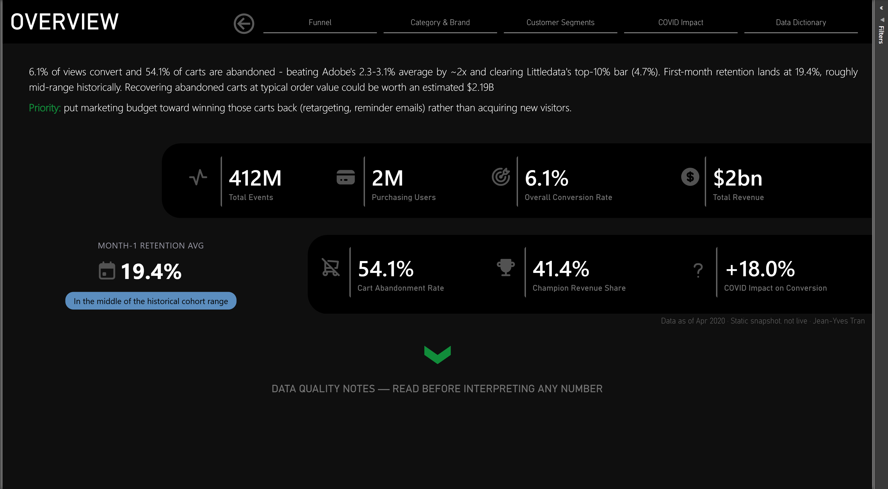
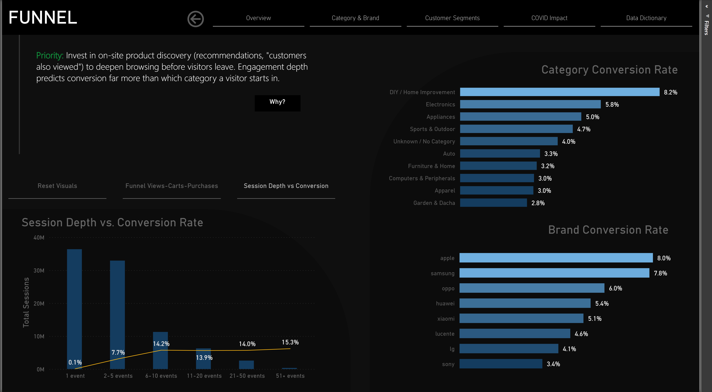
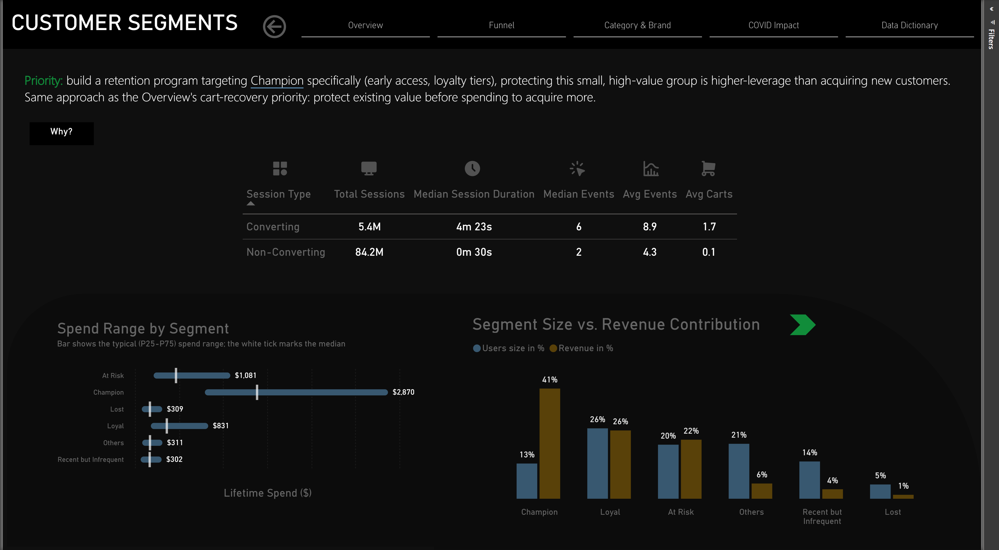
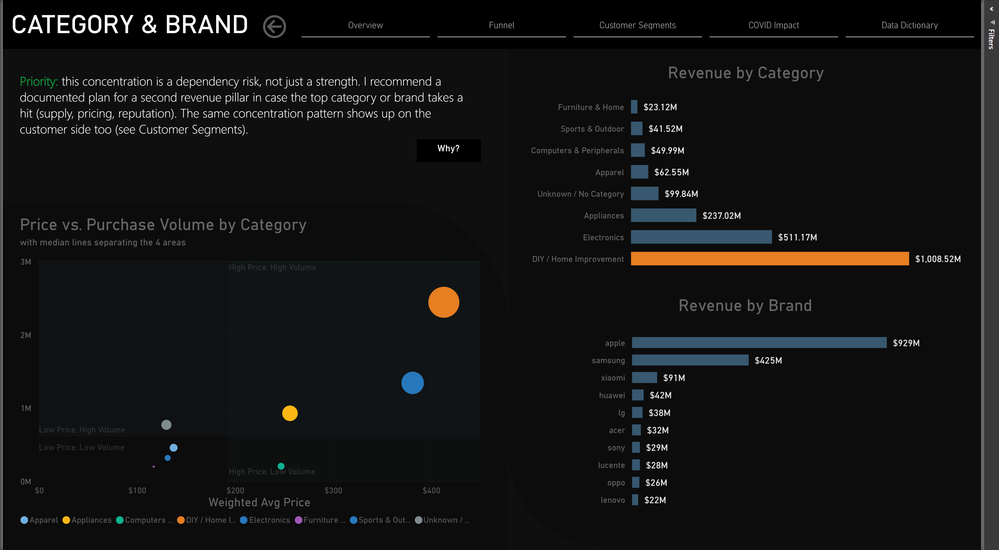
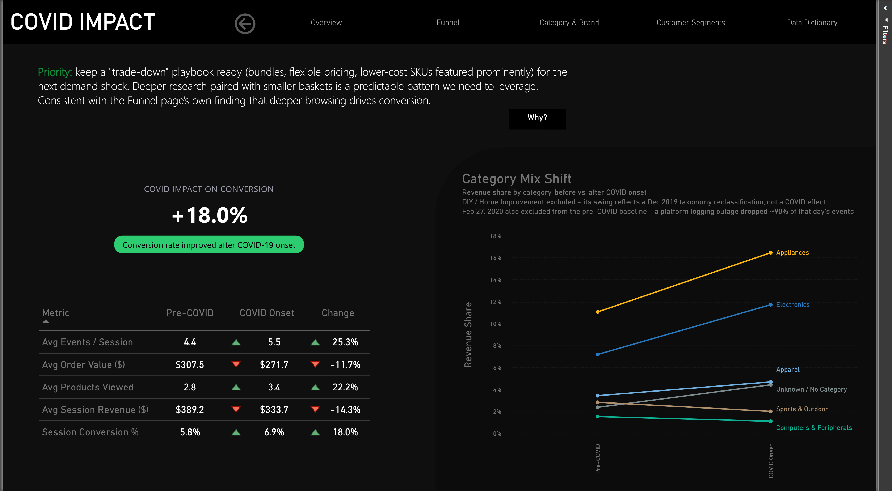
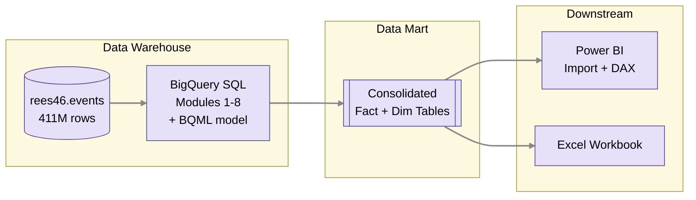

# E-Commerce Behavior Analytics

> **Only 6.1% of product views become a purchase, and 54.1% of the carts that make it that far are abandoned anyway.** This project follows that browser-to-buyer gap through funnel breakdown, cohort retention, RFM segmentation, anomaly detection, and a COVID-onset quasi-experiment, all built directly on Google BigQuery.
> 

[View Interactive Report](https://app.powerbi.com/view?r=eyJrIjoiZDcxYTY4YWItYTllMC00NjAyLWFhMzgtNmRiNTNkMDM1ZDI0IiwidCI6ImM5YTM3Nzk4LTFjNGQtNDY2Ni04YTczLTMzY2M2MzE0ZmVmZSJ9&pageName=overview)

Table of Contents

- [E-Commerce Behavior Analytics](#e-commerce-behavior-analytics)
  - [Key Findings](#key-findings)
  - [Dataset](#dataset)
  - [Platform](#platform)
  - [Analytics Deliverables](#analytics-deliverables)
  - [Data Quality Findings](#data-quality-findings)
  - [Dashboard](#dashboard)
  - [Stack](#stack)
  - [How to Start](#how-to-start)
  - [Why This Project Exists](#why-this-project-exists)
  - [Quick Links](#quick-links)

---

## Key Findings

| Metric | Value |
|---|---|
| Total Revenue | $2.06B |
| Overall Conversion Rate | 6.1% |
| Cart Abandonment Rate | 54.1% |
| Champion Revenue Share | 41% (13% of customers) |

**1. Cart abandonment is the single largest recoverable opportunity in the funnel.** 54.1% of carts abandon before purchase. If those carts converted at the same average order value as completed purchases, that's roughly $2.19B sitting on the table, more than any realistic gain from acquiring new traffic. Treat that number as a ceiling rather than a promise; behavior on an abandoned cart won't automatically match a completed one.

**2. A small customer segment carries most of the revenue, and most of the risk.** Champions make up just 13% of the customer base but generate 41% of revenue, about three times their proportional share. Holding onto that group matters more than chasing new customers at the same pace.

**3. COVID-19 pushed more people to buy, but each one spent less.** Session conversion rose 18.0% and browsing depth rose 25.3% (events per session), while average order value fell 11.7%. That combination fits a broader pattern of buyers trading down under economic uncertainty.

---

## Dataset

**Source:** [eCommerce Behavior Data from Multi Category Store](https://www.kaggle.com/datasets/mkechinov/ecommerce-behavior-data-from-multi-category-store), Kaggle (REES46 Open CDP)

**Nature:** Real behavioral clickstream telemetry from a large live e-commerce platform. REES46 is a B2B SaaS Customer Data Platform, not the retailer itself; this dataset comes from an anonymous client of theirs. The client's identity was never disclosed, but domain research points to Kazakhstan or the wider CIS market, based on the brand inventory in the data (Artel, Cordiant, Redmond, Vitek, Polaris, ARG).

**Category note:** Category codes are machine-translated from Russian retail schemas. `construction` = DIY & Home Improvement; `country_yard` = Garden & Dacha (outdoor/seasonal).

**Scale:** 411 million events across 7 months (October 2019 – April 2020). Flat schema, one row per event; full field-level definitions live in the report's self-updating Data Dictionary page.

**Event scope note:** This schema tracks only product-level interactions (`view` / `cart` / `purchase`), with no event for a raw site visit or search that never touched a product. Every conversion rate here is measured from first product view onward, not total site traffic (see [Data Quality Findings](#data-quality-findings)).

**Time span significance:** Oct 2019 – Feb 2020 is the pre-COVID baseline; Mar–Apr 2020 is the COVID-onset period. Kazakhstan's lockdown began March 16, 2020, so the dataset captures the exact week the country shut down, an unusually clean natural experiment.

**Files on Kaggle:** One CSV per month (Oct 2019 – Apr 2020), ~5–6 GB uncompressed each.

For more detailed domain context on the REES46 dataset, I conducted a [Domain Context Research](./workflows/00_domain_context.md).

---

## Platform

**Google BigQuery**, on a billing-enabled project. Modules 1–7 were built entirely on BigQuery Sandbox's free tier (no credit card, 10 GB active storage, 1 TB query processing per month). Billing was turned on afterward, specifically to unlock BigQuery ML for Module 8 (Purchase Propensity), since `CREATE MODEL` isn't available on the Sandbox tier.

- Standard on-demand pricing still includes 1 TB of free query processing per month; usage beyond that is billed
- No more 60-day table expiry (that was a Sandbox-only limitation)
- Public datasets still don't count against quota

See `workflows/01_bigquery_setup.md` for setup and loading instructions.

---

## Analytics Deliverables

<strong>1. Funnel Analysis</strong>

*SQL: `sql/01_funnel_analysis.sql` · Dashboard: [Funnel page](dashboards/screenshots/02_funnel.png)*

**Question:** What is the conversion rate from view → cart → purchase, and where does it break down?

<strong>2. Session Analytics</strong>

*SQL: `sql/02_session_analytics.sql` · Dashboard: [Funnel page](dashboards/screenshots/02_funnel.png), Session Depth toggle*

**Question:** How do users browse before they buy?

<strong>3. RFM Segmentation</strong>

*SQL: `sql/03_rfm_segmentation.sql` · Notebook: [03_rfm_segmentation.ipynb](notebooks/03_rfm_segmentation.ipynb) · Dashboard: [Customer Segments page](dashboards/screenshots/03_customer_segments.png)*

**Question:** Who are the best customers? Segmented on recency, frequency, and monetary value into Champions / Loyal / At-Risk / Lost.

<strong>4. Cohort Retention</strong>

*SQL: `sql/04_cohort_retention.sql` · Notebook: [04_cohort_retention.ipynb](notebooks/04_cohort_retention.ipynb) · Dashboard: Cohort Detail page (drillthrough from Customer Segments)*

**Question:** Do customers come back? Monthly acquisition cohorts, tracked at 1/2/3/6-month retention.

<strong>5. Category & Brand Performance</strong>

*SQL: `sql/05_category_brand_performance.sql` · Dashboard: [Category & Brand page](dashboards/screenshots/04_category_brand.png)*

**Question:** What drives revenue?

<strong>6. Anomaly Detection</strong>

*SQL: `sql/06_anomaly_detection.sql` · Dashboard: Anomaly Detail page (drillthrough from Overview)*

**Question:** What purchase patterns look suspicious or unusual? Price outliers (IQR method), high-volume sessions, and purchase-frequency anomalies (potential bot/fraud signal).

<strong>7. COVID Quasi-Experiment</strong>

*SQL: `sql/07_covid_experiment.sql` · Notebook: [07_covid_experiment.ipynb](notebooks/07_covid_experiment.ipynb) · Dashboard: [COVID Impact page](dashboards/screenshots/05_covid_impact.png)*

**Question:** Did the COVID-19 onset (March 2020) measurably change purchasing behavior? Tested via two-proportion z-test, pre-COVID (Oct 2019 – Feb 2020) vs. onset (Mar–Apr 2020).

---

## Data Quality Findings

Four significant data quality issues turned up during analysis, each affecting how the results should be interpreted. Full evidence trail: [`data_quality_findings.md`](data_quality_findings.md).

<strong>1. Category Taxonomy Anomaly:</strong> <code>construction</code> ≠ DIY

From December 2019 onward, the `construction` category ("DIY / Home Improvement") is mostly reclassified Apple, Samsung, and Xiaomi electronics rather than real DIY products, so category figures after that date should be read as directional rather than exact. ([Full detail →](data_quality_findings.md#1-category-taxonomy-anomaly-construction--diy))

<strong>2. Logging Gap:</strong> February 27, 2020

February 27, 2020 logged over 90% fewer events than any other day, a platform-side collection failure rather than a real signal, so it's excluded from the COVID pre-period baseline. ([Full detail →](data_quality_findings.md#2-logging-gap-february-27-2020))

<strong>3. Platform Price Cap:</strong> $2,574.07

Every major category tops out at the exact same maximum purchase price, $2,574.07, almost certainly a platform-level ceiling (likely a round 1,000,000 KZT transaction limit) rather than fraud or a data error. IQR outlier flags at the dataset's edges mostly reflect that ceiling rather than genuinely suspicious pricing. ([Full detail →](data_quality_findings.md#3-platform-price-cap-257407), full research trail in [`price_ceiling_research.md`](price_ceiling_research.md))

<strong>4. Funnel Floor Bias:</strong> No Raw Site-Visit Event

This dataset only logs `view`, `cart`, and `purchase` events, with no event for a raw site visit or search that never touched a product. Every conversion rate here, including the 6.1% headline figure, is measured from first product view onward, so true top-of-funnel conversion is almost certainly lower but not something this data can compute. ([Full detail →](data_quality_findings.md#4-funnel-floor-bias-no-raw-site-visit-event))

---

## Dashboard

<strong>Overview:</strong> headline KPIs, dynamic insight text, and the top action priority

<strong>Funnel:</strong> category and brand conversion rates, session depth vs. conversion

<strong>Customer Segments:</strong> RFM segment size vs. revenue contribution, converting vs. non-converting session behavior

<strong>Category & Brand:</strong> revenue concentration by category and brand, price vs. purchase volume

<strong>COVID Impact:</strong> pre/onset behavioral shift and category mix change

Every page pairs its data with a **Priority** action (what to do about it) behind a **Why?** toggle (the reasoning behind it). The full report has 6 visible pages plus a self-updating Data Dictionary, and 3 hidden drillthrough and tooltip pages that add depth without cluttering the nav. See [`dashboards/power_bi_notes.md`](dashboards/power_bi_notes.md) for the complete page architecture and build notes.

---

## Stack

| Layer | Tool | Purpose |
|-------|------|---------|
| Data warehouse | Google BigQuery | Primary query engine, 411M rows |
| Data loading | local CSV.gz → BigQuery | Monthly files loaded directly from local disk via `bq.cmd` |
| SQL | BigQuery SQL | CTEs, Window Functions, UNNEST, partitioning |
| Python | pandas, SciPy, matplotlib | RFM scoring, cohort matrix, statistical tests |
| Notebook | Jupyter / Google Colab | Reproducible analysis |
| BI | Power BI Desktop + Service | Report (.pbix) + live-alert Dashboard; Looker Studio optional |
| Reporting | Excel (openpyxl) | Stakeholder-facing workbook, same KPIs as Power BI, no tooling required |

BigQuery serves as this project's data warehouse: events are transformed, aggregated, and segmented via SQL there, and Module 8's propensity model is trained there too. Those results feed a small data mart ([`powerbi_source_data.xlsx`](dashboards/powerbi_source_data.xlsx)) that Power BI imports. Both the Excel workbook and the Power BI report sit downstream of that mart on static, hardcoded data rather than a live BigQuery connection, and the planned Power BI Service Dashboard (live KPI alerts) was deliberately left unbuilt. All three were deliberate calls, not shortcuts: full reasoning for each lives in [`dashboards/power_bi_notes.md`](dashboards/power_bi_notes.md).

---

## How to Start

<strong>New to this project? Start here</strong>

1. Read [this document](./workflows/01_bigquery_setup.md), covering BigQuery sandbox setup and dataset loading
2. Read `workflows/02_analytics_plan.md`, covering what to build, in what order, with what SQL patterns
3. Tools will be built during execution and stored in `tools/`

**Current state:** BigQuery is loaded and verified: 411,709,736 events across 7 months. Modules 1–7 are complete; Module 8 (Purchase Propensity) SQL is written but not yet run against live BigQuery. The Power BI report is complete across all 8 pages, with explainability tooltips and data-quality disclosures throughout.

---

## Why This Project Exists

<strong>Two-project portfolio strategy, and where this one fits</strong>

This is the second portfolio project in a two-project strategy:

| Project | Dataset | Domain | What it covers |
|---------|---------|--------|----------------|
| [Project 1: TechFlow](../project1_saas_analytics/) | IBM Telco (7,043 records) | SaaS subscription | Churn, LTV, A/B test, Excel automation |
| **Project 2: this project** | REES46 (411M events) | E-commerce behavior | Funnel, retention cohorts, RFM, anomaly detection |

Project 1 speaks to fintech and B2B SaaS roles. This project speaks to product analytics, gaming, e-commerce, and modern data stack roles. The key signal: **event-level behavioral data in BigQuery**, the same structure many companies use, so querying it is a transferable skill.

---

## Quick Links

| Resource | Link |
|---|---|
| Power BI Report | [dashboards/ecommerce_behavior_analytics.pbip](dashboards/ecommerce_behavior_analytics.pbip) |
| Power BI Build Notes | [dashboards/power_bi_notes.md](dashboards/power_bi_notes.md) |
| Excel Dashboard | [dashboards/ecommerce_analytics.xlsx](dashboards/ecommerce_analytics.xlsx) |
| RFM Segmentation Notebook | [notebooks/03_rfm_segmentation.ipynb](notebooks/03_rfm_segmentation.ipynb) |
| Cohort Retention Notebook | [notebooks/04_cohort_retention.ipynb](notebooks/04_cohort_retention.ipynb) |
| COVID Experiment Notebook | [notebooks/07_covid_experiment.ipynb](notebooks/07_covid_experiment.ipynb) |
| SQL Modules (1–8) | [sql/](sql/) |
| Data Quality Findings (full detail) | [data_quality_findings.md](data_quality_findings.md) |
| Price Cap Research | [price_ceiling_research.md](price_ceiling_research.md) |
| BigQuery Setup SOP | [workflows/01_bigquery_setup.md](workflows/01_bigquery_setup.md) |
| Analytics Plan | [workflows/02_analytics_plan.md](workflows/02_analytics_plan.md) |
| Dataset (Kaggle source) | [REES46 eCommerce Behavior Data](https://www.kaggle.com/datasets/mkechinov/ecommerce-behavior-data-from-multi-category-store) |
